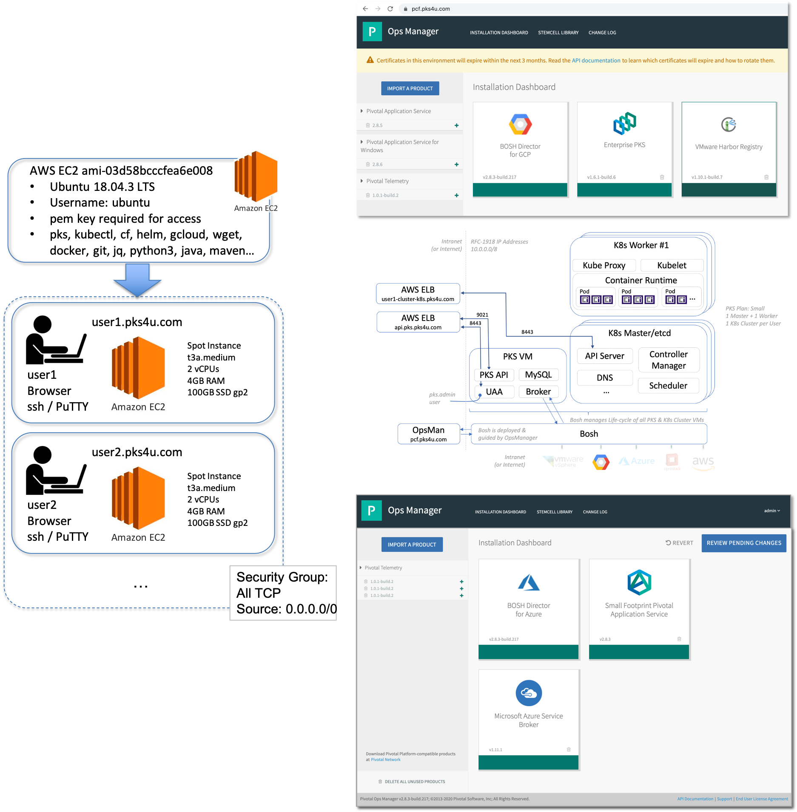

#### [http://tinyurl.com/VMware01012020](https://tinyurl.com/VMware01012020)

# Environment for TKG-i Workshop



# Set-Up Steps for Tanzu-Workshop-TKG-i

- The [TKG-i Workshop](https://github.com/rm511130/Tanzu-Workshop-TKG-i#vmware-tkg-i-workshop) needs quite a lot of set-up for it to work well. These instructions are in constant evolution, but they will help you with all the key set-up steps. It's recommended that you start by looking through the [Labs](https://github.com/rm511130/Tanzu-Workshop-TKG-i#vmware-tkg-i-workshop) to get better acquainted with what is expected of the workshop attendees.
- When this workshop was first created, PKS had not yet been rebranded to TKG-i, so this page is being revised _as we speak_ and as changes occur. For example, if the PKS CLI changes to TKG-i CLI, you will see the change reflected here as well.

## Step 0 - Customizing the TKG-i Workshop & Expectations

- `Fork` my `https://github.com/rm511130/Tanzu-Workshop-TKG-i` repo to add, change or delete content. Do not use my repo as-is because it contains, for example, a link to a Google Spreadsheet that needs to be unique per Workshop.
- Once you have your own forked version of the repo, you can start by correcting the date & time in the agenda so it matches your workshop date, time and duration.
- It's usually advisable to add an easy to remember [tinyurl.com](https://tinyurl.com) link at the top of the page. Place a link that points at your forked workshop github URL. For example, I would use [http://tinyurl.com/VMware01012020](https://tinyurl.com/VMware01012020) if the Workshop was aimed at VMware on 01-01-2020.
- The workshop was developed with the help of a MacBook. From the perspective of a workshop attendee, the workshop has been tested with Windows PCs, but from the perpective of who is running the and setting-up the workshop environments, a MacBook was used and not a Windows PC.
- The workshop, as it stands, makes use of a public domain `pks4u.com`. You will need to use your own public domain to be able to effectively run this workshop. I used [GoDaddy](https://www.godaddy.com/) to find, puchase and manage the `pks4u.com` domain.

## Step 1 - Manage-PKS Repo a.k.a. How to easily create accessible K8s Clusters on PKS on GCP

- Using your MacBook, check if you have the following directory:
```
cd /work/manage-pks/gcp
```

- If you don't, you should execute the following commands:

```
mkdir -p /work; cd /work
git clone https://github.com/rm511130/manage-pks
cd /work/manage-pks/gcp
ls
```
- You should see the following files:

```
01-playing-with-provisioning.sh
02-playing-with-accessing.sh
03-playing-with-cleaning-up.sh
04-playing-with-pks-delete-cluster.sh
manage-cluster	
manage-cluster-provision-v2
```

## Step 2 - PKS Environment

- You need a target PKS environment. 
- In my case I have PKS 1.6.1 on GCP using OpsMan 2.8.3 and I also have Harbor 1.10.1 installed.
- To get your own PKS installation on GCP you'll need a GCP account and these [notes/instructions](https://drive.google.com/open?id=1tnTE30pek6H0tAwPZqhvRzxM6ZAKg5EG)

- My OpsMan URL is: `https://pcf.pks4u.com`           with credentials: `admin / r4tyuKW_q`
- My PKS API is at: `api.pks.pks4u.com`               with credentials: `pks_admin / r4tyuKW_q`
- Harbor is at:     `https://harbor.pks.pks4u.com`    with credentials: `admin / r4tyuKW_q`

- To get into my GCP account I use:  

```
Mac $ gcloud auth login
``` 
and 

```
Mac $ open https://console.cloud.google.com/
```

- My Godaddy `pks4u.com` domain nameservice has been delegated to `GCP` for management.

## Step 3 - AWS VMs for workshop Attendees

- AWS Ubuntu VMs (t2.medium or t3a.medium) need to be up and running for each workshop attendee. 
- I use the `AWS spot instances` to limit the overall cost associated with running the workshop.

```
https://console.aws.amazon.com/
```

- These VMs are based on a Public AWS AMI: `ami-03d58bcccfea6e008`. They come with multiple CLIs: `pks, cf, helm, gcloud, wget, docker, git, jq, python3, ...`

- These VMs are accessible via the use of a [`pem`](https://github.com/rm511130/Tanzu-Workshop-PKS/blob/master/fuse.pem) or [`ppk`](https://github.com/rm511130/Tanzu-Workshop-PKS/blob/master/fuse.pem) key. 
- Workshop attendees are asked, as a set of pre-requisite steps, to make sure they can access the `user1.pks4u.com` VM a few days before the workshop is scheduled to take place.

```
ssh -i ~/Downloads/fuse.pem ubuntu@user1.pks4u.com
```

- You will need to create your own `pem` key and then [convert](https://tecadmin.net/convert-pem-to-ppk-via-putty/) it to the `ppk` format so that both Mac and Windows PC PuTTY users may have easy access to their workshop VMs.

- Given that GCP nameservers are used to manage the `pks4u.com` domain, the Public IP addresses of the Workshop Attendee's VMs must match the DNS entries on GCP: `user1.pks4u.com`, `user2.pks4u.com`, etc... to `user20`.

- If the AWS VMs have been `stopped`, you'll need to start them and copy their public IP addresses oover to GCP DNS entries. The public IP addresses do change every time you start the VM.

- You can cut & paste from the AWS console into an Excel Spreadsheet and then create the gcloud commands for the creation of the DNS entries.

- How do you determine what are the `user#.pks4u.com` DNS entries already in place?

```
gcloud dns record-sets list --zone pks4u-zone --filter=Type=A | grep user..pks4u.com
```

- The command shown above produces the following type of output:

```
user1.pks4u.com.               A     5    54.160.63.114
user2.pks4u.com.               A     5    54.237.216.69
user3.pks4u.com.               A     5    3.89.192.76
```

- Here are the commands you will have to tweak to get the new IP addresses in place:

```
gcloud dns record-sets transaction start --zone=pks4u-zone
gcloud dns record-sets transaction add 35.36.111.222 --name=user3.pks4u.com --zone=pks4u-zone --ttl=5 --type=A
gcloud dns record-sets transaction add 18.56.1.223 --name=user4.pks4u.com --zone=pks4u-zone --ttl=5 --type=A
gcloud dns record-sets transaction add 15.36.11.224 --name=user5.pks4u.com --zone=pks4u-zone --ttl=5 --type=A
gcloud dns record-sets transaction add 215.16.121.225 --name=user6.pks4u.com --zone=pks4u-zone --ttl=5 --type=A
gcloud dns record-sets transaction execute --zone=pks4u-zone
```
Output:
```
Transaction started [transaction.yaml].
Record addition appended to transaction at [transaction.yaml].
Record addition appended to transaction at [transaction.yaml].
Record addition appended to transaction at [transaction.yaml].
Record addition appended to transaction at [transaction.yaml].
Executed transaction [transaction.yaml] for managed-zone [pks4u-zone].
Created [https://dns.googleapis.com/dns/v1/projects/fe-rmeira/managedZones/pks4u-zone/changes/169].
ID   START_TIME                STATUS
169  2020-03-18T21:44:10.046Z  pending
```

- Check, using a sample of the VMs, whether you can log in:

```
ssh -i ~/Downloads/fuse.pem ubuntu@user3.pks4u.com
```

## Step 5 - Check whether all the PKS UAA Users are in place

```
ssh ubuntu@pcf.pks4u.com
source 0.sh; source 1.sh
```
-  The `0.sh` and `1.sh` files are explained [here](https://drive.google.com/open?id=1tnTE30pek6H0tAwPZqhvRzxM6ZAKg5EG). They are simple scripts to gain access to the Bosh Director and PKS UAAC.

```
ubuntu@pks4u-ops-manager:~$ cat 0.sh

# use source 0.sh to run this script
bosh alias-env bosh-pks -e 10.0.0.10 --ca-cert /var/tempest/workspaces/default/root_ca_certificate
bosh -e bosh-pks login << EOT
director
coEtmPabcdefhg6s8Vsf
EOT
shopt -s expand_aliases
alias bosh='bosh -e bosh-pks'
```

```
ubuntu@pks4u-ops-manager:~$ cat 1.sh

# run this script using the command $ source 1.sh
echo "Targeting PKS API VM UAA"
uaac target https://api.pks.pks4u.com:8443 --ca-cert /var/tempest/workspaces/default/root_ca_certificate
# using admin / secret from PCF > PKS Tile > Credentials > .properties.pks_uaa_management_admin_client
uaac token client get admin -s RiqYeabcdefskksjj
uaac users | grep name
uaac users | grep clients
echo "You can now issue commands such as:"
echo "        $ uaac user add pks_admin --emails pks_admin@pivotal.io -p r4tyuKW_q"
echo "        $ uaac member add pks.clusters.admin pks_admin"
echo "        $ uaac user add pks_manager --emails pks_manager@pivotal.io -p r4tyuKW_q"
echo "        $ uaac member add pks.clusters.manage pks_manager"
echo "        $ uaac user add generic_k8s_user --emails generic_k8s_user@pivotal.io -p r4tyuKW_q"
echo "          (in this example, generic_k8s_user can be referenced in rolebindings to give/take permissions)"
```

- Check whether the output shows all the `devops[2..22]` users and the `user[2..22]` users.
- Check whether the output also shows `pks_admin` and `pks_manager`

- If these users (devopsID, userID) are not present, then continue as follows:

```
for i in {2..22}; do uaac user add devops$i --emails devops$i@vmware.com -p password ;done
for i in {2..22}; do uaac member add pks.clusters.manage devops$i   ; done
for i in {2..22}; do uaac user add user$i --emails user$i@vmware.com -p password ;done
```

## Step 6 - Create K8s Clusters for every Workshop Attendee

- We need to `pks create-cluster user[2..22]-cluster.pks4u.com --plan small ...` but there's an easy way to accomplish this:

- To do this, we're going to use some scripts found at: 

```
cd /work/manage-pks/gcp
```
- First, let's check if the clusters `user[2..22]-cluster` already exist:

```
pks login -a https://api.pks.pks4u.com:9021 -u pks_admin -p r4tyuKW_q -k
pks clusters
```
- Expected Output
```
PKS Version    Name            k8s Version  Plan Name  UUID                                  Status     Action
1.6.1-build.6  shared-cluster  1.15.5       small      54ba6181-cfbe-452b-87fa-f690a39fc8b7  succeeded  CREATE
1.6.1-build.6  user2-cluster   1.15.5       small      77db4a28-bd8e-4a1d-9541-bcd46f5da9e8  succeeded  CREATE
1.6.1-build.6  user3-cluster   1.15.5       small      f9dbce9f-c694-4730-b2bb-a9447c1d25ba  succeeded  CREATE
...
1.6.1-build.6  user22-cluster  1.15.5       small      f9dbce9f-c694-4730-b2bb-a9447c1d25ba  succeeded  CREATE
```

- If you don't see the output shown above then use `vi` to take a look at the following scripts before running them:

```
cd /work/manage-pks/gcp
vi 01-playing-with-provisioning.sh
```
- And check if the brackets have the right numbers: `for i in {2..22}`
- If they do, then go ahead and execute: `./01-playing-with-provisioning.sh`
- Then wait for completion: `watch pks clusters`

- Once you have `Status: succeeded` for every-cluster proceed to the step below:

```
cd /work/manage-pks/gcp
vi 02-playing-with-accessing.sh
```
- And check if the brackets have the right numbers: `for i in {2..22}`
- If they do, then go ahead and execute: `./02-playing-with-accessing.sh`
- Then check on `gcloud` to see if the DNS Entries and Load Balancers are in place for each `user[2.22]-cluster`:

```
gcloud dns record-sets list --zone pks4u-zone --filter=Type=A | grep cluster-k8s.pks4u.com
```

- All going well, you should be able to log into each cluster as `pks_admin` and each `userID` should be able to see only their specidic cluster `userID-cluster`:

```
pks login -a https://api.pks.pks4u.com:9021 -u pks_admin -p r4tyuKW_q -k; pks clusters
for i in {2..22}; do pks login -a https://api.pks.pks4u.com:9021 -u devops$i -p password -k; pks cluster user$i-cluster; done
```

## Step 7 - Create a K8s Shared-Cluster with Roles and Rolebindings

- The `share-cluster` needs to exist with access allowed for `userID` to `namespaceID` and nothing else. Let's check:

```
pks login -a https://api.pks.pks4u.com:9021 -u pks_admin -p r4tyuKW_q -k
pks cluster shared-cluster
pks get-credentials shared-cluster
kubectl get namespaces
kubectl get rolebindings --all-namespaces
kubectl get roles --all-namespaces
```

- If the output is not a long list of roles and rolebindings associated to a long list of namespaces... then you have to create them:

```
cd /work/manage-pks/gcp
./manage-cluster-provision-v2 shared-cluster small pks4u-zone
```

- It will run for 10 minutes. After completion, you can then continue with the execution of the following two files. Both files are included in this repo.

```
cd /work/pks4lbrands
./create-vmware-role-yml.sh
./create-vmware-rolebinding-yml.sh
```
- You should see a long list of roles and rolebindings as the output.

## Step 8 - The Bonus Lab

- The Workshop Bonus Lab is executed on PAS running on Azure. Don't worry if you don't have PAS running on Azure, it's actually quite easy to spin up PAS on Azure using the [Azure Marketplace](https://portal.azure.com/#blade/Microsoft_Azure_Marketplace). Search for _Pivotal Platform on Microsoft Azure_ and follow the wizard based process. You will end-up with PAS on Azure using a Domain that will look something like this: `13.86.190.177.cf.pcfazure.com`

- To check whether it's ready, execute the following commands:

```
for i in {2..25}; do cf login -a api.sys.13.86.190.177.cf.pcfazure.com --skip-ssl-validation -p password -u user$i; done
```

- If the users, orgs and spaces are not in place, execute the following commands:

```
cf api api.sys.13.86.190.177.cf.pcfazure.com --skip-ssl-validation
cf login -u admin -p RnAg-ux-xmFyM5j9xr6c6gZYdHTbnIKl
cf enable-feature-flag diego_docker
for i in {1..25}; do cf create-org org$i; done
for i in {1..25}; do cf create-user user$i password; done
for i in {1..25}; do cf create-space workshop -o org$i; done
for i in {1..25}; do cf set-org-role user$i org$i OrgManager; done
for i in {1..25}; do cf set-space-role user$i org$i workshop SpaceManager; done
for i in {1..25}; do cf set-space-role user$i org$i workshop SpaceDeveloper; done
```

## Step 9 - Tanzu Mission Control

- During Lab-9, the users will need to execute something similar to this command on their respective `userID-cluster`:
```
kubectl apply -f 'https://tanzupaorg.tmc.cloud.vmware.com/installer?84f9abcdef4c98' 
```

- The actual command comes from TMC. So you need to log into TMC.

```
open https://console.cloud.vmware.com
# log in as rmeira@pivotal.io  (in my case with the same password you use for PivNet!)
# select the TMC tile
# clustergroup:  lb-workshop
# attach-cluster:  userID
# Register and grab the command: kubectl apply -f 'https://tanzupaorg.tmc.cloud.vmware.com/installer?cdaf669189f24952'
# Verify connection later (it will last 48hrs)
```

- Ideally you should get them all done one day in advance, and have them added to the Google Spreadsheet for ease of access

```
user2:   kubectl apply -f 'https://tanzupaorg.tmc.cloud.vmware.com/installer?9c40fb3e92522445'
user3:   kubectl apply -f 'https://tanzupaorg.tmc.cloud.vmware.com/installer?b81828fa990791dd'
user4:   kubectl apply -f 'https://tanzupaorg.tmc.cloud.vmware.com/installer?44ad766e31ff61d6'
user5:   kubectl apply -f 'https://tanzupaorg.tmc.cloud.vmware.com/installer?ebe44a84d681d946'
user6:   kubectl apply -f 'https://tanzupaorg.tmc.cloud.vmware.com/installer?daaac8b13514f5b8'
user7:   kubectl apply -f 'https://tanzupaorg.tmc.cloud.vmware.com/installer?a612682da1f2c66f'
user8:   kubectl apply -f 'https://tanzupaorg.tmc.cloud.vmware.com/installer?6fbacf4342bba4e9'
user9:   kubectl apply -f 'https://tanzupaorg.tmc.cloud.vmware.com/installer?9fda5e3c13cd39cf'
user10:  kubectl apply -f 'https://tanzupaorg.tmc.cloud.vmware.com/installer?25ebdafbbaa63616'
user11:  kubectl apply -f 'https://tanzupaorg.tmc.cloud.vmware.com/installer?ae0ee4d1c59cbfce'
user12:  
user13:
user14:
user15:
user16:
user17:
user18:
user19:
user20:
```

# Problems

## Problem with SSH

- If you get the following type of message when trying to access one of the Ubuntu VMs on AWS it's because you have conflicting/vestigial information in your `/Users/ralphmeira/.ssh/known_hosts` file.

```
ssh -i ~/Downloads/fuse.pem ubuntu@user1.pks4u.com
@@@@@@@@@@@@@@@@@@@@@@@@@@@@@@@@@@@@@@@@@@@@@@@@@@@@@@@@@@@
@       WARNING: POSSIBLE DNS SPOOFING DETECTED!          @
@@@@@@@@@@@@@@@@@@@@@@@@@@@@@@@@@@@@@@@@@@@@@@@@@@@@@@@@@@@
The ECDSA host key for user1.pks4u.com has changed,
and the key for the corresponding IP address 18.206.16.45
is unknown. This could either mean that
DNS SPOOFING is happening or the IP address for the host
and its host key have changed at the same time.
@@@@@@@@@@@@@@@@@@@@@@@@@@@@@@@@@@@@@@@@@@@@@@@@@@@@@@@@@@@
@    WARNING: REMOTE HOST IDENTIFICATION HAS CHANGED!     @
@@@@@@@@@@@@@@@@@@@@@@@@@@@@@@@@@@@@@@@@@@@@@@@@@@@@@@@@@@@
IT IS POSSIBLE THAT SOMEONE IS DOING SOMETHING NASTY!
Someone could be eavesdropping on you right now (man-in-the-middle attack)!
It is also possible that a host key has just been changed.
The fingerprint for the ECDSA key sent by the remote host is
SHA256:SZBhEMWMeuyS+9Yj+7DzbcJXcWzFMGz5biv3kmQMdH8.
Please contact your system administrator.
Add correct host key in /Users/ralphmeira/.ssh/known_hosts to get rid of this message.
Offending ECDSA key in /Users/ralphmeira/.ssh/known_hosts:64
ECDSA host key for user1.pks4u.com has changed and you have requested strict checking.
Host key verification failed.
```

- As you can see in the error message above, the system tells you exactly where the conflicting information can be found. In my example, the issue is on `line 64` of the `/Users/ralphmeira/.ssh/known_hosts` file.

- Corrective action:

```
sed -i '64d' /Users/ralphmeira/.ssh/known_hosts
```


